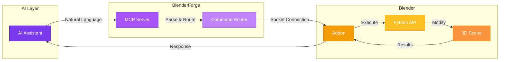

<div class="hero-section">

# BlenderForge

<p class="hero-gradient">
Transform your 3D workflow with the power of AI.<br>
Create, modify, and control Blender using natural conversation.
</p>

<div class="hero-badges">
<span class="badge badge--primary">v1.0.5</span>
<span class="badge badge--accent">MCP Protocol</span>
<span class="badge badge--success">MIT License</span>
<span class="badge badge--new">AI-Powered</span>
</div>

</div>

---

<div class="stats-grid">
<div class="stat-card">
<div class="stat-number">40+</div>
<div class="stat-label">MCP Tools</div>
</div>
<div class="stat-card">
<div class="stat-number">481+</div>
<div class="stat-label">AI Clients</div>
</div>
<div class="stat-card">
<div class="stat-number">5</div>
<div class="stat-label">AI Features</div>
</div>
<div class="stat-card">
<div class="stat-number">100%</div>
<div class="stat-label">Open Source</div>
</div>
</div>

---

## :zap: Why BlenderForge?

<div class="grid" markdown>

<div class="card" markdown>
### :material-robot: AI-First Design
Built from the ground up for AI interaction. Connect Claude, ChatGPT, Copilot, or any of **481+ MCP-compatible** AI assistants directly to Blender.
</div>

<div class="card" markdown>
### :material-message-text: Natural Language
Forget complex menus and Python scripts. Just **describe what you want** in plain English - "Create a red metallic sphere with soft lighting."
</div>

<div class="card" markdown>
### :material-lightning-bolt: Instant Results
Watch your 3D scenes come to life in **real-time** as you chat. No waiting, no compiling - just immediate visual feedback.
</div>

<div class="card" markdown>
### :material-puzzle: Extensible
Use built-in tools or **execute custom Python** for unlimited possibilities. Download assets from PolyHaven, generate 3D from text, and more.
</div>

</div>

---

## :rocket: Quick Start

Get up and running in under 2 minutes:

=== ":simple-python: pip"

    ```bash
    pip install blenderforge
    ```

=== ":simple-astral: uv"

    ```bash
    uv pip install blenderforge
    ```

=== ":simple-pipx: pipx"

    ```bash
    pipx install blenderforge
    ```

### Configure Your AI

Add BlenderForge to your AI assistant's configuration:

```json title="Claude Desktop - claude_desktop_config.json"
{
  "mcpServers": {
    "blenderforge": {
      "command": "blenderforge"
    }
  }
}
```

!!! tip "Universal Compatibility"
    BlenderForge uses the **Model Context Protocol (MCP)** - an open standard supported by hundreds of AI assistants. If your AI supports MCP, it works with BlenderForge!

[:octicons-arrow-right-24: Full Installation Guide](getting-started.md){ .md-button }
[:octicons-book-24: AI Client Setup](ai-clients.md){ .md-button .md-button--secondary }

---

## :sparkles: See It In Action

Instead of learning complex Blender menus and Python scripts, just describe what you want:

<div class="demo-container" markdown>

```
You: Create a cozy coffee shop scene with wooden tables,
     warm lighting, and some coffee cups on the tables.

AI: I'll create that cozy coffee shop for you! Let me:

    ✓ Setting up warm HDRI lighting (2700K color temperature)
    ✓ Creating wooden tables with realistic PBR materials
    ✓ Adding ceramic coffee cups with steam particles
    ✓ Placing decorative elements (plants, books, napkins)
    ✓ Adjusting camera for an inviting atmosphere

    Your scene is ready! The warm lighting creates a
    welcoming atmosphere perfect for a café environment.
```

</div>

---

## :art: AI-Powered Features

<div class="grid" markdown>

<div class="card" markdown>
### :material-palette-swatch: Material Generator
<span class="badge badge--new">New</span>

Create stunning PBR materials from text descriptions:

> "Brushed copper with green patina and fingerprint smudges"

Generates complete node setups with proper roughness, metallic, and normal maps.
</div>

<div class="card" markdown>
### :material-brain: Smart Scene Analyzer

Get professional feedback on your 3D work:

- **Composition** analysis with rule of thirds
- **Lighting** quality assessment
- **Material** realism scoring
- **Performance** optimization tips
</div>

<div class="card" markdown>
### :material-human: Auto-Rig System

Automatically rig characters with proper bone hierarchies:

- Spine, arms, legs detection
- IK/FK ready setup
- Weight painting assistance
- Animation-ready output
</div>

<div class="card" markdown>
### :material-lightbulb: Smart Lighting

One-click professional lighting setups:

- **Studio** - Clean product shots
- **Cinematic** - Dramatic film look
- **Natural** - Realistic daylight
- **Dramatic** - High contrast mood
</div>

</div>

---

## :desktop_computer: Core Capabilities

| Capability | Description | Example |
|------------|-------------|---------|
| :material-cube-scan: **Query Scene** | Get detailed information about your scene | "What objects are in this scene?" |
| :material-cube-outline: **Create Objects** | Add and modify 3D primitives and meshes | "Add a UV sphere at the origin" |
| :material-palette: **Materials** | Create, modify, and apply materials | "Make it glossy red metal" |
| :material-lightbulb-on: **Lighting** | Set up and adjust scene lighting | "Add dramatic rim lighting" |
| :material-code-tags: **Python Code** | Execute any Blender Python command | Complex custom operations |
| :material-camera: **Screenshots** | Capture viewport and render images | Visual documentation |
| :material-download: **Asset Import** | Download free textures, HDRIs, models | "Get a brick texture from PolyHaven" |
| :material-cube-send: **3D Generation** | Generate models from text/images | "Generate a 3D chair from this image" |

---

## :globe_with_meridians: Works With Your Favorite AI

BlenderForge connects seamlessly to any MCP-compatible AI assistant:

| AI Assistant | Developer | Platform | Status |
|--------------|-----------|----------|--------|
| **Claude Desktop** | Anthropic | Desktop App | :white_check_mark: Full Support |
| **Claude Code** | Anthropic | CLI/Terminal | :white_check_mark: Full Support |
| **ChatGPT Desktop** | OpenAI | Desktop App | :white_check_mark: Full Support |
| **VS Code + Copilot** | Microsoft | IDE | :white_check_mark: Full Support |
| **Cursor** | Cursor Inc | IDE | :white_check_mark: Full Support |
| **Windsurf** | Codeium | IDE | :white_check_mark: Full Support |
| **Zed** | Zed Industries | Editor | :white_check_mark: Full Support |
| **Continue.dev** | Continue | IDE Extension | :white_check_mark: Full Support |

!!! info "Open Standard"
    MCP (Model Context Protocol) is like **USB for AI tools**. Any AI that "speaks MCP" automatically works with BlenderForge - no special integration needed. With **481+ compatible clients**, you have options!

---

## :building_construction: Architecture

BlenderForge creates a seamless bridge between AI and Blender:



<div class="grid" markdown>

<div class="card" markdown>
### :material-transit-connection-variant: How It Works

1. **You speak** naturally to your AI assistant
2. **MCP Server** translates your intent to Blender commands
3. **Blender Addon** executes via the Python API
4. **Results** flow back as natural language responses
</div>

<div class="card" markdown>
### :material-security: Secure by Design

- **Local-first**: No internet required for core features
- **Sandboxed**: Code execution is validated for safety
- **Transparent**: Open source, auditable code
- **No telemetry**: Your work stays private
</div>

</div>

---

## :package: System Requirements

| Component | Minimum | Recommended |
|-----------|---------|-------------|
| **Python** | 3.10+ | 3.11+ |
| **Blender** | 3.0+ | 4.x (Latest) |
| **OS** | Win/Mac/Linux | Any supported |
| **Memory** | 4GB | 8GB+ |
| **Network** | Localhost only | Localhost only |

---

## :link: Get Started Now

<div class="grid" markdown>

[:material-download: **Install BlenderForge**](getting-started.md){ .md-button }

[:material-tools: **Browse 40+ Tools**](tools-reference.md){ .md-button }

[:material-star: **AI Features**](ai-features.md){ .md-button }

[:material-github: **View on GitHub**](https://github.com/mithun50/blenderforge){ .md-button }

</div>

---

## :heart: Open Source

BlenderForge is **MIT licensed** and completely free to use. Contributions are welcome!

<div class="grid" markdown>

<div class="card" markdown>
### :material-source-pull: Contribute

- Report bugs and issues
- Submit feature requests
- Create pull requests
- Improve documentation

[:octicons-mark-github-16: GitHub](https://github.com/mithun50/blenderforge){ .md-button }
</div>

<div class="card" markdown>
### :material-account-group: Community

- Star the repository
- Share with friends
- Write tutorials
- Join discussions

[:material-star: Star on GitHub](https://github.com/mithun50/blenderforge){ .md-button }
</div>

</div>

---

<div style="text-align: center; padding: 2rem 0;">

Made with :purple_heart: by **[Mithun Gowda B](https://github.com/mithun50)**

<small>BlenderForge v1.0.5 | MIT License | [GitHub](https://github.com/mithun50/blenderforge) | [PyPI](https://pypi.org/project/blenderforge/)</small>

</div>
